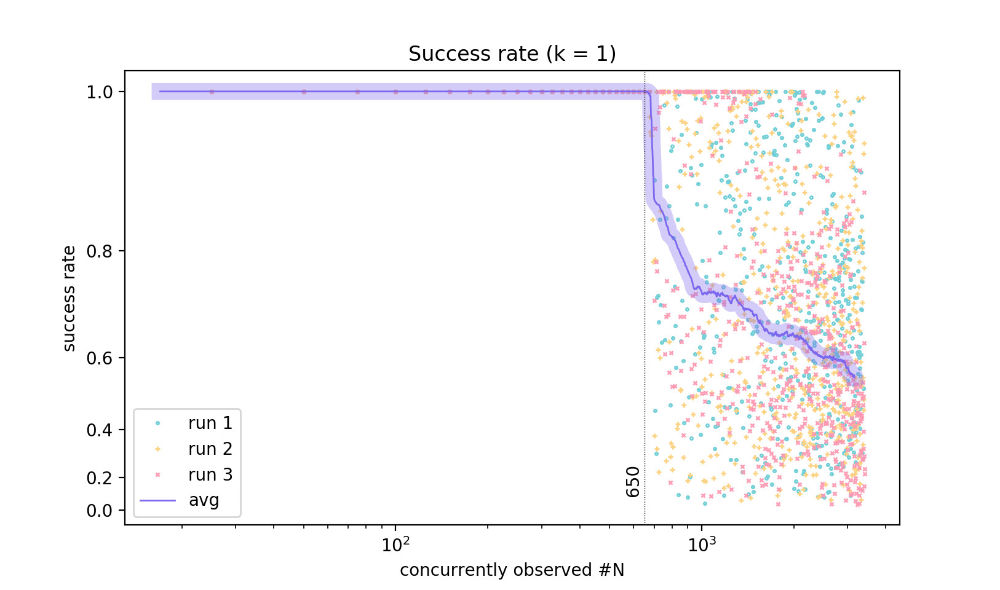

## NOTE

This was my attempt to patch the build process around GNU Make. Afterwards I switched to the duo of [GN](https://gn.googlesource.com/gn)-[Ninja](https://ninja-build.org).

# Craft

More than Make.

**craft**<br>
&nbsp;&nbsp;&nbsp;&nbsp;*verb*&nbsp;&nbsp;&nbsp;&nbsp;to **make** or produce with care, skill, or ingenuity.

Craft is a build monitor on top of Make, a build utility.

With minimal changes of code, it can be applied to other build systems, like Google's [Ninja](https://ninja-build.org), as well.

### 1. Use case
Often times, a project has a (or more) complicated Makefile (handwritten or generated). Lots of information, the majority of them being the commands executed, is printed to stdout when Make is executing the Makefile.

To suppress the verbose printout, one could take one of the approaches:
- redirect the output to `/dev/null`,
- add `@` in front of a command in Makefile as to silence it.

But both completely silence the output, leaving the developer no knowledge of what command is being executed. To sum up, the *pain point* is that developers want to know which command is being executed by Make at any given moment, but they do not want Make to echo the exact commands. In a word, they want a **[succinct]** real-time printout.

Moreover, in some cases developers may be interested in the exact commands that were executed, mainly in order to debug the project. Therefore, they want a **[logging]** feature as well. In addition to the exact commands, these info are also useful: stdout, stderr, exit status, times (processor time and real time: start, finish, elapse).

This is where Craft comes in.

### 2. Prerequisites
- macOS or Linux (sorry, no Windows).
- GNU Make, 3.81 or higher.
- C compiler supporting C11.
- Python 2.7, or Python 3.5 or higher.

### 3. Limitations
This project is taken from a larger C/C++ project of mine, and I don't intend to generalize it at the moment.<br>
Also, Craft is not tested on *large* project in industry; it is a hobby project, after all.

### 4. Overview
Craft has a simple architecture. It is basically a client-server pattern, but the communication between clients and the server is monodirectional. In light of this, Craft has three components:
- manager: the top-level API, which invokes `make` for you,
- observer: the program (client) that runs commands and capture commands' output,
- recorder: the program (server) that logs reports sent by observers.

The recorder is an event-driven server, as opposed to a multiprocessing/multithreading one, because the number of observers trying to send data to it at (almost) the same time is potentially large. The server does not reply with ACK to clients.

In a highly concurrent situation, a client's connection request might be refused by the server, due to a limited backlog size on the server's socket. Therefore, the client would try connection 3 times before aborting. That being said, normally one attempt is sufficient, and this claim is backed up by section 2 in [perf](perf/README.md).

Each (interested) command in Makefile will be invoked by the observer, and a Makefile may contain a fairly large amount of commands. Therefore, it is crucial that each observer only adds a **[minimal runtime overhead]**. Therefore, the observer is written in C. Fear not, however - if the manager finds the observer is not compiled or is out-of-date, it will automatically compile it for you.

### 5. Testing, performance

#### Testing script
```shell
# to ensure correct behavior
$ ./run-test.py
OK.
```

#### Performance

[perf/README.md](perf/README.md): measure its (a) runtime overhead and (b) server's success rate.

When *N* observed commands execute sequentially, the overhead Craft adds is:
```
overhead ~ C + N * a ~ O(N)

	fixed overhead    C = 0.1504 sec
	variable overhead a = 0.0045 sec each
```

This plot demonstrates the overhead (note the left y-axis is logarithmic).


This plot shows the success rate at `k = 1`, i.e. the client aborts after 1 unsuccessful attempt to connect to the server.



### 6. How to use

0. Ensure no other programs are using `localhost:8081`, i.e. this command should return nothing:
	```she
	lsof -t -i :8081 # get ID of process listening to port 8081
	```

1. Add `$(OBSERVER)` to the compiler name in your existing Makefile. In other words, instead of having
	```makefile
	CXX = clang++ # or g++
	LD  = ld      # or gold
	```
	you should define the compiler for C++ `CXX` like this (and `CC`, `LD`, `AR`, and so forth):
	```makefile
	OBSERVER = # empty
	CXX = $(OBSERVER) clang++ 
	LD  = $(OBSERVER) ld
	```
	Then every command that uses `CXX`, `LD`, etc. will be invoked and monitored by an observer.

	[example makefile](tests/makefile).

	> To make your Makefile runnable without Craft, you should define `OBSERVER` to be empty in Makefile. This way, you are still able to use your Makefile as before.

2. Instead of executing `make ARGS` in the console to invoke Make, run `craft [OPTIONS] [-- ARGS]` instead, where `OPTIONS` are arguments to Craft, and `ARGS` are arguments to Make. Example:
	```shell
	craft.py                    # no args given to Craft, and call Make like 'make'
	craft.py -w log.json        # ask Craft to write logs, and call Make like 'make'
	craft.py -w log.json -- -j8 # ask Craft to write logs, and call Make like 'make -j8'
	craft.py -- tests -j8       # no args to Craft, and call Make like 'make tests -j8'
	```

For help, `craft.py --help`.

You can play with recorder and observer without the manager - see the comment at the start of [recorder.py](recorder.py).

### 7. Try it yourself
In this project directory:

```shell
make -C tests clean
./craft.py -w log.json -- -C tests -j2 # run: make -C tests -j2
```
> Make refresh:<br>'make -C dir' means running Make in path *dir*.<br>'make -jN' means *N* concurrent Make processes.

The example makefile: [tests/makefile](tests/makefile).<br>
The example log: [example-log.json](example-log.json).<br>
The example real-time output in console (see, more succinct than Make echoing every command):
```
$ ./craft.py -w log.json -- -C tests -j2
execute: make -C tests -j2
recorder server established: localhost:8081
[Compile] => chrome1.o
[Compile] => chrome2.o
[Library] => libchrome.so
[Compile][Link] => chrome
[Compile] => content_shell.o
[Link] => content_shell
[Compile] => browser_unittest.o
[Link] => browser_unittest
```

###### EOF
