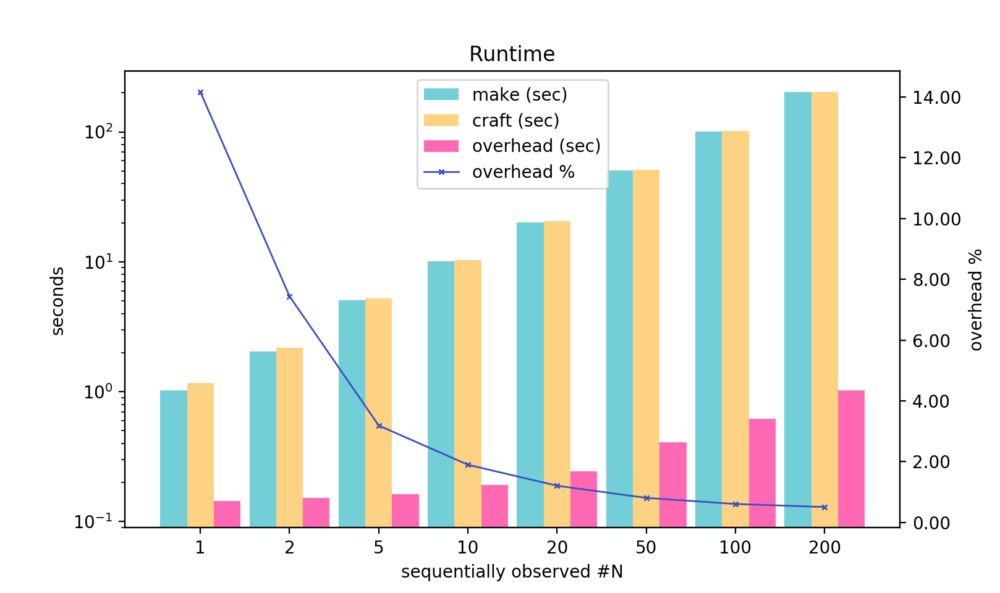
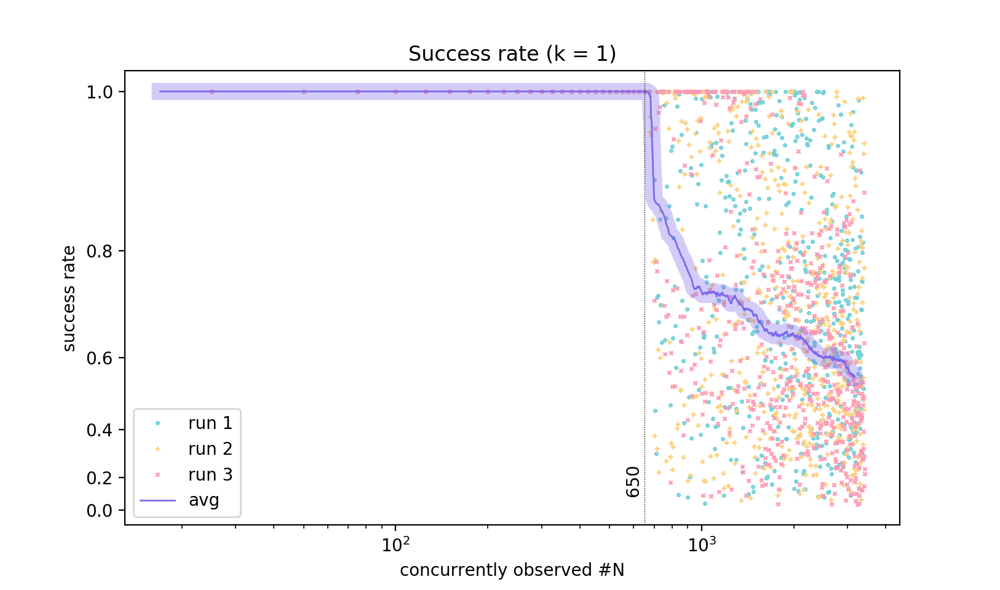

# perf

This provides a very rudimentary performance analysis. Very basic, really.

### 1. overhead

Sequential commands. Each command uses fake compiler [g++](./g++), which does nothing other than pausing for 1.0 second.

Platform for the results: macOS 10.14, Python 2.7, Clang -O3, 2.5 GHz Intel Core i7.

Make command used:
```shell
# one process, tasks are done sequentially
make -f N.make
```

Craft command used:
```shell
../craft.py -- -f N.make
```

In this directory:

```shell
$ ./perf.py 2 # run 2 makefiles
run: 0.make     observed commands: 0
run: 1.make     observed commands: 1
filename   |  make      craft   overhead
-----------|---------------------------
0.make     |   0.011,   0.156,  1350.80 %
1.make     |   1.018,   1.166,  14.47 %
```

```shell
$ ./perf.py # run all makefiles
run: 0.make     observed commands: 0
run: 1.make     observed commands: 1
run: 2.make     observed commands: 2
run: 5.make     observed commands: 5
run: 10.make    observed commands: 10
run: 20.make    observed commands: 20
run: 50.make    observed commands: 50
run: 100.make   observed commands: 100
run: 200.make   observed commands: 200
filename   |  make      craft   overhead
-----------|-----------------------------
0.make     |  00.011,  00.154,  1324.01 %
1.make     |  01.020,  01.164,  14.16 %
2.make     |  02.032,  02.184,  7.44 %
5.make     |  05.062,  05.224,  3.19 %
10.make    |  10.117,  10.309,  1.90 %
20.make    |  20.211,  20.456,  1.21 %
50.make    |  50.520,  50.928,  0.81 %
100.make   |  101.049,  101.665,  0.61 %
200.make   |  202.112,  203.140,  0.51 %
```



```
overhead = python interpreter starting time
           + craft starting time
           + recorder server starting time
           + recorder log dumping disk I/O
           + N * (observer overhead + recorder handling overhead)
         ~ C + N * a
         ~ O(N)

	fixed overhead    C = 0.1504 sec
	variable overhead a = 0.0045 sec each
```

### 2. success rate

Let's bomb the server with (almost) concurrent requests!

Success rate is crucial. Ideally, we want every observer's request to send data succeeds, meaning the recorder can log every observed commands.

Because the [server](../recorder.py) is event-driven, we really do not want the handlers be blocking. Though there is no disk or network IO in the handlers, computations still take time, and hence the server is unable to turn to new incoming requests during that time, and has to leave them in the socket's backlog queue. When the backlog is full (i.e. congestion occurs), the server has no other choice but to discard overflowing requests. 

Each task defined in [makefile](bomb.make) has one observed command, and these tasks are executed by unlimited number of Make workers concurrently<sup>*</sup>. The fake compiler is [quick](./quick), which prints out something and returns immediately, making the frequency of observer request very high - higher than normal compilers, as they need time to parse source files, do optimization works, and emit code.

In normal usage, however, a very high request frequency is *unusual*, because (1) each task takes longer time to complete (described above), (2) the number of workers is typically constrained (using `make -jN` instead of `make -j`), and (3) some tasks are dependent on some others so that these tasks cannot be started arbitrarily concurrently.

Platform for the results: macOS 10.14, Python 2.7, Clang -O3, 2.7 GHz Intel Xeon E5 (24 logical cores), 64 GB memory.

Craft command used:
```shell
# unlimited workers running concurrently: make -f bomb.make t0 t1 ... tN -j
# for example, when N = 9: make -f bomb.make t0 t1 t2 t3 t4 t5 t6 t7 t8 -j
../craft.py -w bomb.json -- -f bomb.make t0 t1 ... tN -j
```

#### when kClientMaxAttempts = 1

First, in [observer.h](../utils/observer.h) modify the value of `kClientMaxAttempts` to 1.<br>
Then, in this directory:
```shell
$ ./perf2.py
# don't want to wait? Keyboard interrupt: dump results to file prematurely
```
Finally, do not forget to change `kClientMaxAttempts` back to 3.

[run 1](./perf2-res-1.txt), [run 2](./perf2-res-2.txt), [run 3](./perf2-res-3.txt).

This plot shows the success rate at `k = 1`, i.e. the client aborts after 1 failed attempt to connect to the server.



#### when kClientMaxAttempts = 3

The success rate is always 100% from 0 tasks to 20303 tasks<sup>*</sup>.

> \* Taken from GNU Make manual:
```
-j [jobs], --jobs[=jobs]
        Specifies the number of jobs (commands) to run simultaneously. If there is more than one -j
        option, the last one is effective.  If the -j option is given without an argument, make will
        not limit the number of jobs that can run simultaneously.
```

##### Worth noting
On this machine, when `kClientMaxAttempts` is 1, the success rate is also always 100% from 0 tasks to 20303 tasks<sup>*</sup>:<br>
&nbsp;&nbsp;&nbsp;&nbsp;Linux, Python 2.7, GCC -O3, 3.7 GHz Intel Xeon GOLD 6154 (72 logical cores), 192 GB memory.

> \* if we pass more than 20303 task names, the OS throws an error complaining about argument being too long. For example, a typical Linux limits the memory to store arguments passed to the system call `execve()`, to 32 pages (or 128 KB). It is defined by `MAX_ARG_STRLEN` in `/usr/include/linux/binfmts.h`.

###### EOF